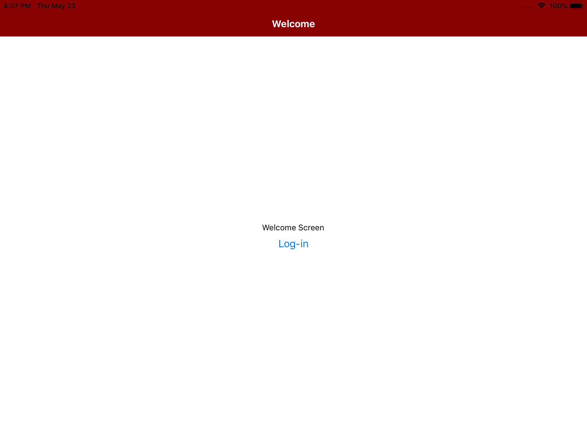
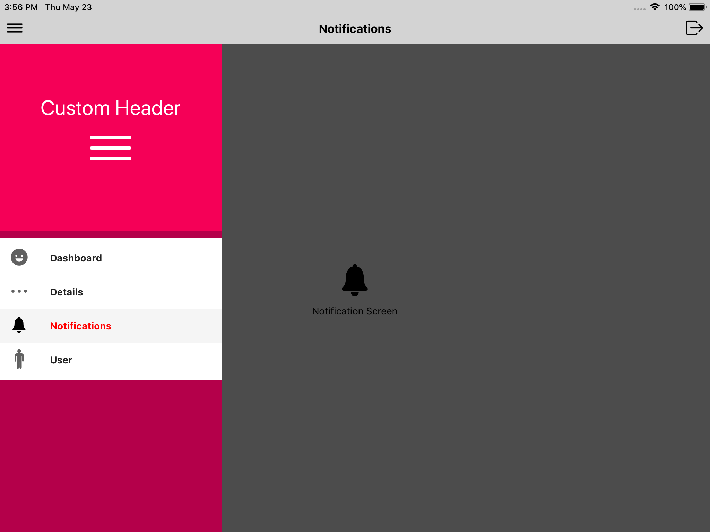

# Quick example for React Native Standard App Navigation

Standard App Navigation with Side-Menu 

Implemented with StackNavigator + DrawerNavigator

(StackNavigator for Log-in/Auth and DrawerNavigator for App business logic screens)

    
    
    

react - "16.8.3",

react-native - "0.59.8",

react-navigation - "3.11.0"

## Requirements

Node 8 or greater is required. Development for iOS requires a Mac and Xcode 9 or up, and will target iOS 9 and up.

You also need to install the dependencies required by React Native:

- for [Android development](https://facebook.github.io/react-native/docs/getting-started.html#installing-dependencies-3)
- for [iOS development](https://facebook.github.io/react-native/docs/getting-started.html#installing-dependencies)

## Run demo

Assuming you have all the requirements installed, you can setup and run the project by running:

- `yarn` to install the dependencies
- `yarn start`  to run the iOS application on IPad simulator
- `react-native run-android` to run the Android application (remember to start a simulator or connect an Android phone)
- `react-native run-ios` to run the iOS application (remember to start a simulator or connect an iPhone phone)

## License

This project is released under the [MIT License](LICENSE).

react-native link react-native-vector-icons

react-native link react-native-gesture-handler
